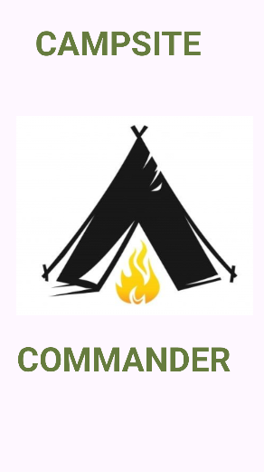
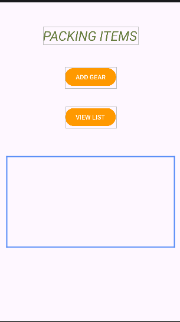
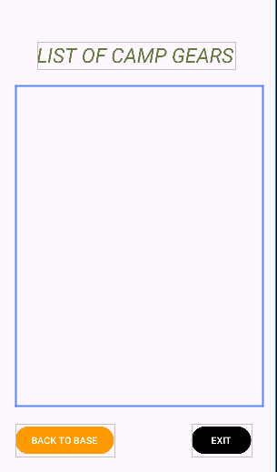

# Campsite Commander App

## Overview
Campsite Commander is an Android inventory app designed for outdoor adventure packing management. It allows users to store, categorize, and view camping gear in a structured checklist format.

## Features
- Splash screen with 3-second loading delay
- Add gear functionality (basic interaction simulation)
- Category-based packing system (Shelter, Food, Safety)
- Total item calculation using loops
- Detailed checklist view
- Navigation between screens
- Exit button for closing the app
- Camp site/safari theme styling

## Technology Used
- Kotlin
- Android Studio
- XML Layouts
- Intents (screen navigation)
- Parallel arrays
- Loops

## App Flow
Splash Screen → Main Screen → Detailed View Screen

## Data Structure
The app uses parallel arrays:
- Item Names
- Categories
- Quantities
- Comments

## How it works
1. App starts with splash screen (3 seconds)
2. Main screen displays total packed items
3. User navigates to checklist view
4. Detailed screen shows full packing list
5. User can exit or go back

## Screenshots of UI
### Splash screen

### Main screen

### Detatiled view screen 

